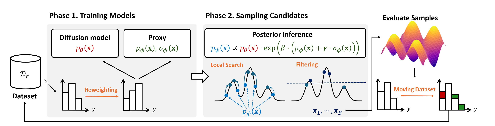

DiBO introduces a novel framework that combines diffusion models with ensemble-based uncertainty quantification to solve high-dimensional black-box optimization problems. By iteratively training diffusion models to capture data distributions and fine-tuning them for posterior inference, our method effectively balances exploration and exploitation in high-dimensional spaces, outperforming existing approaches across various synthetic and real-world tasks.

For a visual explanation of the DiBO framework, please see the image below:

You can find the paper [here](https://arxiv.org/abs/2502.16824).