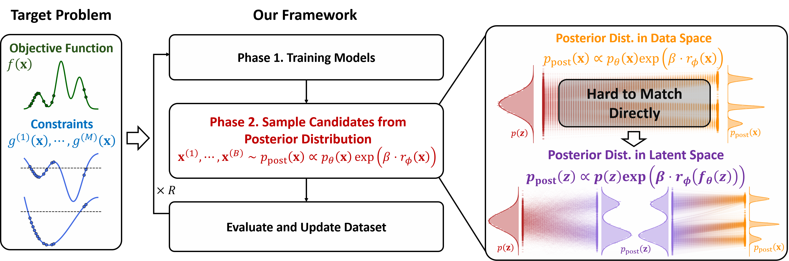
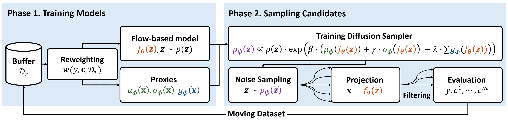

CiBO introduces a novel framework for constrained black-box optimization that addresses the challenges of high dimensionality and multi-modal posterior distributions. By leveraging flow-based models to perform posterior inference in a lower-dimensional latent space, our method effectively handles the complexity of constrained optimization problems while maintaining computational efficiency. This approach significantly improves scalability and solution quality compared to existing methods, particularly in scenarios with binary constraint feedback and highly multi-modal target distributions.

For a visual explanation of the CiBO framework, please see the image below:

