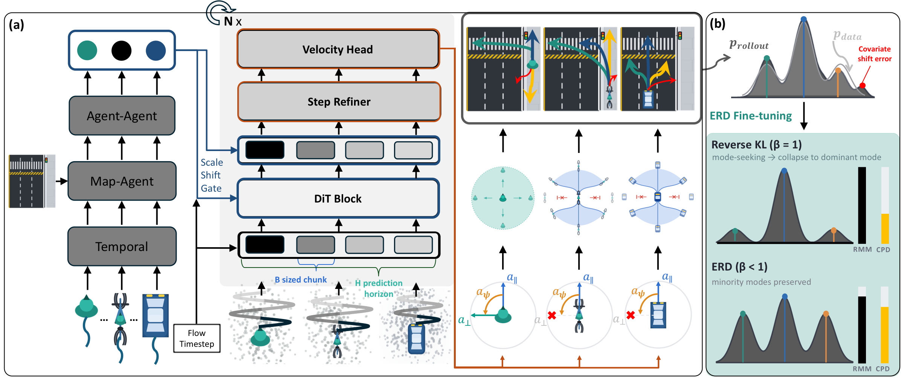

Flow-ERD is a multi-agent traffic simulator that jointly pursues realism and diversity for closed-loop autonomous driving simulation. It combines Agent-Type Aware Flow Matching (AFM) with Entropy-Regularized Distillation (ERD) to preserve diverse plausible behaviors while mitigating closed-loop covariate shift.

You can find the paper on [arXiv](https://arxiv.org/abs/2607.06957) and the project page [here](https://seulbinhwang.github.io/flow-erd-project-page/).
